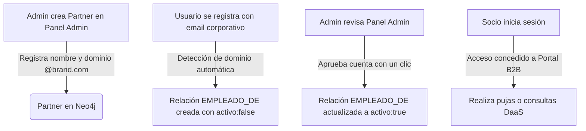

# Documentación Técnica: Sistema de Monetización B2B y Dashboard de Administración

Esta documentación describe la arquitectura, el modelo de datos en grafos (Neo4j) y el flujo de seguridad implementado para la monetización B2B y el Dashboard del Administrador en el proyecto **Recetario**.

---

## 1. Arquitectura y Flujo General

El sistema permite que socios comerciales (marcas como Hellmann's, Nestlé o Carrefour) accedan a herramientas corporativas avanzadas de monetización en el grafo (Graph Bidding, Stock Clearance y Predictive Flavor Analytics).

La seguridad y los permisos de estas herramientas se gestionan de forma dinámica en la base de datos de grafos mediante relaciones de usuario. El ciclo de vida operativo es el siguiente:



---

## 2. Modelo de Datos en Neo4j (Grafo B2B)

El modelo utiliza tres nodos y una relación clave para estructurar la seguridad corporativa:

### Nodos
* **`(:Usuario)`**: Representa a los usuarios del sistema. Posee propiedades como `nombre`, `mail` y `contrasena`. El usuario administrador cuenta con la propiedad especial `isAdmin: true`.
* **`(:Partner)`**: Representa a las marcas comerciales asociadas. Posee:
  * `nombre`: Nombre de la empresa (ej: `'Hellmanns'`).
  * `tier`: Nivel de servicio contratado (`'BRAND'`, `'RETAIL'`, o `'ENTERPRISE'`).
  * `dominio`: Dominio oficial de email corporativo de la empresa (ej: `'hellmanns.com'`).
* **`(:Ingrediente)`**: Nodo de ingrediente sobre el cual las marcas realizan pujas publicitaria usando la propiedad `pesoPatrocinio` (número flotante).

### Relaciones
* **`(:Usuario)-[r:EMPLEADO_DE]->(:Partner)`**: Conecta a un usuario registrado con una marca. Posee el atributo:
  * `activo`: Booleano (`true` o `false`). Determina si el administrador ya aprobó el acceso del usuario para pujar o ver analíticas a nombre de la empresa.

---

## 3. Seguridad y Controladores del Servidor

### A. Middleware de Autenticación de Administrador (`utils/adminAuth.js`)
Protege los endpoints de administración (`/api/admin/*`). Intercepta la petición y realiza una consulta rápida a Neo4j para validar si el usuario solicitante posee la propiedad `isAdmin: true`:
```cypher
MATCH (u:Usuario {nombre: $userName}) RETURN u.isAdmin AS isAdmin
```
Si es falso o no existe, retorna un código de error de seguridad `403 Forbidden`.

### B. Middleware de Autenticación B2B (`utils/b2bAuth.js`)
Controla el acceso a las APIs corporativas (`/api/b2b/*`). Resuelve la marca del usuario solicitante mediante su email (cabecera `X-USER-EMAIL`) ejecutando una consulta en el grafo que exige que la relación de empleado esté confirmada y activa:
```cypher
MATCH (u:Usuario {mail: $email})-[r:EMPLEADO_DE]->(p:Partner)
WHERE r.activo = true
RETURN p.nombre AS nombre, p.tier AS tier
```
Si no existe la relación o `activo` es `false`, retorna `403 Forbidden` impidiendo que el empleado opere o vea analíticas comerciales.

### C. Registro Automático con Coincidencia de Dominio
En el controlador [`usuariosController.js`](file:///c:/Users/lucas/.gemini/antigravity/scratch/recetario/controllers/usuariosController.js), al crear una cuenta nueva, el backend extrae el dominio del correo y busca si coincide con alguna empresa registrada. De ser así, crea la relación B2B de forma automática pero en estado **inactivo** (`activo: false`) para esperar la aprobación del administrador:
```cypher
MATCH (u:Usuario {nombre: $nombre})
WITH u
MATCH (p:Partner)
WHERE toLower(split(u.mail, '@')[1]) = toLower(p.dominio)
MERGE (u)-[:EMPLEADO_DE {activo: false}]->(p)
```

---

## 4. Endpoints de la API Administrativa (`/api/admin`)

* **`GET /stats`**: Devuelve estadísticas totales del grafo (usuarios, recetas, marcas, pujas activas).
* **`GET /partners`**: Lista todas las marcas comerciales, sus niveles y dominios.
* **`POST /partners`**: Registra o actualiza una marca comercial (Parámetros: `nombre`, `tier`, `dominio`).
* **`DELETE /partners/:nombre`**: Elimina una marca comercial y desvincula a todos sus usuarios.
* **`GET /users`**: Lista todos los usuarios comunes registrados en el sistema indicando su correo y si tienen una relación B2B pendiente o aprobada.
* **`POST /users/associate`**: Asocia manualmente a un usuario común a una marca (lo aprueba con `activo: true` inmediatamente).
* **`POST /users/confirm`**: Aprueba y activa una relación de socio corporativo pendiente (`r.activo = true`).
* **`POST /users/dissociate`**: Desvincula a un usuario de cualquier socio B2B (elimina la relación `[:EMPLEADO_DE]`).
