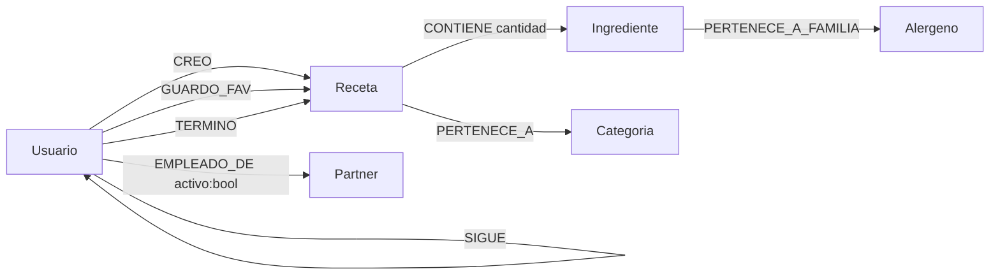
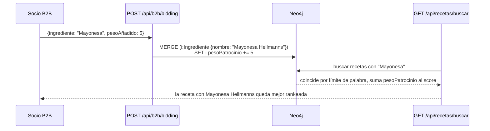

# Arquitectura

## Modelo de dominio (grafo)

Todo el estado vive en Neo4j como nodos y relaciones — no hay ORM ni capa de
mapeo objeto-relacional, los controladores ejecutan Cypher directo.



- **Usuario**: `nombre`, `mail`, `contrasena`, `isAdmin`.
- **Receta**: `id` (UUID), `titulo`, `dificultad`, `tiempo`, `porciones`, `pasos`, `imagen`.
- **Ingrediente**: `nombre`, `pesoPatrocinio` (usado por el motor de bidding, ver abajo).
- **Partner**: marca comercial — `nombre`, `tier` (`BRAND` / `RETAIL` / `ENTERPRISE`), `dominio`.

## Motor de recomendación colaborativa

`GET /api/usuarios/:nombre/recomendaciones` recorre el grafo dos saltos:
usuarios que guardaron las mismas recetas que "yo", y qué más guardaron ellos
que yo todavía no tengo. Si no hay señal colaborativa (usuario nuevo), cae a un
fallback por popularidad general. Es el mismo patrón que un sistema de
recomendación "gente que compró X también compró Y", expresado en dos
`MATCH` de Cypher en vez de un job de batch aparte.

## Buscador inteligente

`GET /api/recetas/buscar` filtra por ingredientes que el usuario tiene,
excluye los que no quiere y los alérgenos declarados, y hace *fuzzy matching*
por límites de palabra para que "Aceite" encuentre también "Aceite
Hellmanns" — necesario porque los ingredientes patrocinados llevan el nombre
de la marca concatenado (ver siguiente sección).

## Graph Bidding — patrocinio de ingredientes

La capa B2B (`/api/b2b/*`) es el experimento más particular del proyecto:
en vez de banners, las marcas socias suman peso (`pesoPatrocinio`) a un nodo
`Ingrediente`. El buscador sabe leer ese peso: cuando una receta contiene un
ingrediente patrocinado, su `ScoreFinal` sube y aparece antes en los
resultados.



Autenticación de esta capa vía dos middlewares (`utils/adminAuth.js`,
`utils/b2bAuth.js`) que resuelven el rol contra el grafo en cada request —
no hay JWT ni sesión firmada, ver [limitaciones conocidas](../README.md#limitaciones-conocidas).

## Frontend

`FrontEnd/` no tiene build step: React y Babel se cargan desde CDN
(`unpkg`, con integridad SRI) y los `.jsx` se transpilan en el navegador vía
`<script type="text/babel">`. Express sirve la carpeta como estática
(`express.static('FrontEnd')`). Suficiente para el alcance del TP, pero no es
el patrón que usaríamos para producción — un bundler evitaría transpilar en
cada carga de página.

## Endpoints, por dominio

| Grupo | Base | Qué hace |
|---|---|---|
| Usuarios | `/api/usuarios` | alta, login, perfil, favoritos, seguir/dejar de seguir, recomendaciones |
| Recetas | `/api/recetas` | alta y consulta (sin update/delete), buscador inteligente, receta del día, tendencias, feed de seguidos |
| Dashboard | `/api/dashboard` | estadísticas agregadas, top creadores |
| B2B | `/api/b2b` | bidding de ingredientes, analytics de co-ocurrencia (tier Enterprise) |
| Admin | `/api/admin` | gestión de partners y de relaciones usuario↔partner |

## Queries de ejemplo

```cypher
// Buscador: recetas que uso "tengo" pero excluyendo "no quiero"
MATCH (r:Receta)
WHERE NOT EXISTS {
  MATCH (r)-[:CONTIENE]->(ex:Ingrediente) WHERE ex.nombre IN $no_quiero
}
MATCH (r)-[:CONTIENE]->(i:Ingrediente) WHERE i.nombre IN $tengo
RETURN r.titulo, count(DISTINCT i) AS coincidencias
ORDER BY coincidencias DESC
```

```cypher
// Recomendación colaborativa: qué guardaron usuarios con gustos parecidos
MATCH (yo:Usuario {nombre: $nombre})-[:GUARDO_FAV]->(:Receta)<-[:GUARDO_FAV]-(otro:Usuario)
MATCH (otro)-[:GUARDO_FAV]->(recomendacion:Receta)
WHERE NOT (yo)-[:GUARDO_FAV]->(recomendacion)
RETURN recomendacion.titulo, count(otro) AS nivelDeMatch
ORDER BY nivelDeMatch DESC LIMIT 5
```
